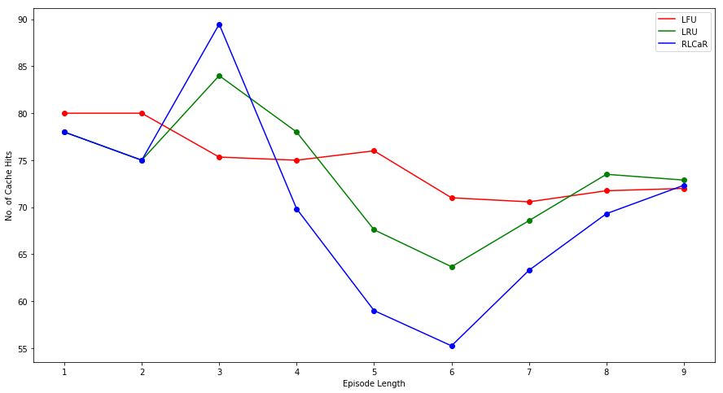

# RLCaR: Deep Reinforcement Learning Framework for Optimal and Adaptive Cache Replacement
Adaptive Cache replacement strategies have shown superior performance in comparison to classical strategies like LRU and LFU. Some of these strategies like Adaptive Replacement Cache (ARC), Clock with Adaptive Replacement (CAR) are quite effective for day to day applications but they do not encode access history or truly learn from cache misses. We propose a reinforcement learning framework, RLCaR which seeks to tackle these limitations. We use TD 0 model-free algorithms like Q-Learning, Expected SARSA and SARSA to train our agent to efficiently replace pages in cache in order to maximize the cache hit ratio. We also developed a memory cache simulator in order to test our approach and compare it with LRU and LFU policies. 
.png "Model Architecture")

### Comparison with LRU and LFU:

